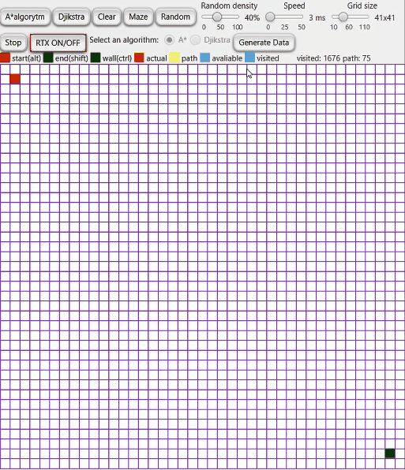

# PathfindingVisualizer

This project uses Java and JavaFX to visualize pathfinding algorithms: A* and Dijkstra.

## Comparision on empty grid

| A* algorithm | Dijkstra algorithm |
| :---:      | :---:       |
|      |  |

## Maze creation(Kruskal's method and random)

| Kruskal's method | Random low/high density |
| :---: | :---: |
|  | |

## RTX ON/OFF - Real Time Experience :) - pick an algorithm
You can move start and end nodes and in the meantime it will calculate path. Turn on and pick an algorithm with a radio button.

| A* algorithm | Dijkstra algorithm |
| :---:      | :---:       |
|      |  |

## Draw your own mazes
Just hold ctrl and draw walls, alt and shift to change location of start and end nodes respectively.

## Visited nodes and path count
Counts visited squares and path length.

## Clear
Just clears the grid.

## Change options
You can change a few options: random density, speed, grid size.

## Generate Data
Logs map(x, y, isWall, isStart, isEnd, Colour) to a file.

